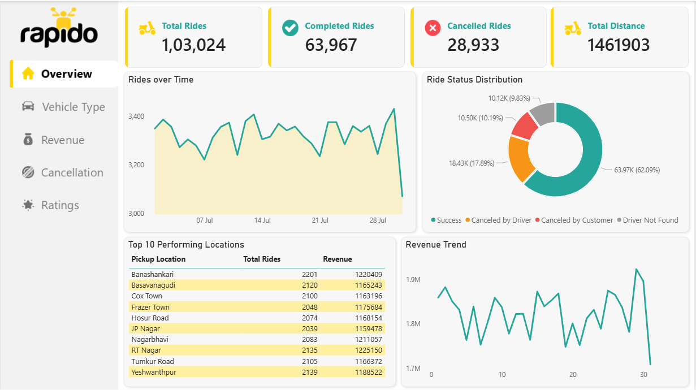

# 🧾 Rapido Ride Analytics &  Performance – Power BI, SQL

_Analyzing ride-hailing efficiency, cancellations, revenue patterns, and customer experience to support operational decision-making using SQL and Power BI._

---

## 📌 Table of Contents
- <a href="#overview">Overview</a>
- <a href="#business-problem">Business Problem</a>
- <a href="#dataset">Dataset</a>
- <a href="#tools--technologies">Tools & Technologies</a>
- <a href="#project-structure">Project Structure</a>
- <a href="#data-cleaning--preparation">Data Cleaning & Preparation</a>
- <a href="#dashboard">Dashboard</a>
- <a href="#research-questions--key-findings">Research Questions & Key Findings</a>
- <a href="#how-to-run-this-project">How to Run This Project</a>
- <a href="#final-recommendations">Final Recommendations</a>
- <a href="#author--contact">Author & Contact</a>

---

<h2><a class="anchor" id="overview"></a>Overview</h2>

This project evaluates ride-hailing operations to generate insights into booking trends, cancellations, revenue distribution, and service quality. A complete analytical workflow was built using SQL for data processing and Power BI for visualization.  

The dashboard provides a comprehensive view of ride performance, helping stakeholders monitor key metrics and identify operational inefficiencies.

---

<h2><a class="anchor" id="business-problem"></a>Business Problem</h2>

Efficient ride management is critical for customer satisfaction and revenue optimization. This project aims to:

- Identify major causes of ride cancellations  
- Analyze revenue distribution across locations and vehicle types  
- Evaluate driver and customer behavior  
- Monitor service quality using ratings  
- Improve operational efficiency and decision-making  

---

<h2><a class="anchor" id="dataset"></a>Dataset</h2>

- Ride booking dataset (~1.03 lakh records)  
- Includes booking details, vehicle type, location, payment method, and ratings  

---

<h2><a class="anchor" id="tools--technologies"></a>Tools & Technologies</h2>

- SQL (Data extraction and transformation)  
- Power BI (Dashboard and visualization)  
- DAX (Measures and KPIs)  
- Excel/CSV (Data source)  
- GitHub  

---

<h2><a class="anchor" id="project-structure"></a>Project Structure</h2>

```

Rapido Ride Analytics &  Performance
│
├── README.md
├── data/
│ └── bookings.csv
│
├── sql/
│ └── rapido.sql
│
├── dashboard/
│ └── rapido_dashboard.pbix
│
├── Images/
│ └──image1.png 
│ └──image2.png 
│ └──image3.png 
│ └──image4.png 
│
└── Rapido Ride Analytics & Operational Performance.pdf
```


---

<h2><a class="anchor" id="data-cleaning--preparation"></a>Data Cleaning & Preparation</h2>

- Removed duplicate and inconsistent records  
- Handled missing values  
- Standardized data formats  
- Created derived metrics (revenue, ride count, ratings)  
- Prepared dataset for analysis  

---

<h2><a class="anchor" id="dashboard"></a>Dashboard</h2>

Power BI dashboard provides:

- Ride performance (total, completed, cancelled rides)
- Revenue analysis
- Vehicle performance
- Cancellation trends
- Ratings analysis




---
<h2><a class="anchor" id="research-questions--key-findings"></a>Research Questions & Key Findings</h2>

- Cancellation Trends: Driver cancellations are higher than customer cancellations
- Revenue Analysis: Revenue is concentrated in key locations
- Vehicle Performance: Premium and Bike segments perform strongly
- Payment Trends: Cash dominates but digital payments are increasing
- Service Quality: Ratings (~4.0) indicate good customer satisfaction

---

<h2><a class="anchor" id="how-to-run-this-project"></a>How to Run This Project</h2>

1. Clone the repository:
```bash
git clone https://github.com/mahimakumari2/rapido-ride-analysis.git
```
2. Navigate to the project folder:
```bash
cd rapido-ride-analysis
```
3. Load the dataset:
```bash
Open the dataset from the /data folder (CSV/Excel file)
Ensure column names match the Power BI model
```
4. Run SQL queries (optional):
```bash
Open sql/rapido_queries.sql in MySQL Workbench or any SQL tool
Execute queries to explore data and create views
```
5. Open Power BI dashboard:
```bash
Open dashboard/rapido_dashboard.pbix in Power BI Desktop
Click on Refresh to load data
```
6. Explore the dashboard:
```bash
Use filters (Vehicle Type, Location, Payment Method)
Analyze trends, cancellations, revenue, and ratings
```
---

<h2><a class="anchor" id="final-recommendations"></a>Final Recommendations</h2>

- Reduce driver cancellations through incentives
- Improve vehicle availability in high-demand areas
- Promote digital payment methods
- Optimize pricing strategies
- Improve service quality

---

<h2><a class="anchor" id="author--contact"></a>Author & Contact</h2>

Mahima
Data Analyst

📧 Email: mahima.kumari0223@gmail.com  
🔗 [LinkedIn](https://www.linkedin.com/in/mahimakumari/)  
🔗 [Portfolio](https://mahimakumari.netlify.app/)
